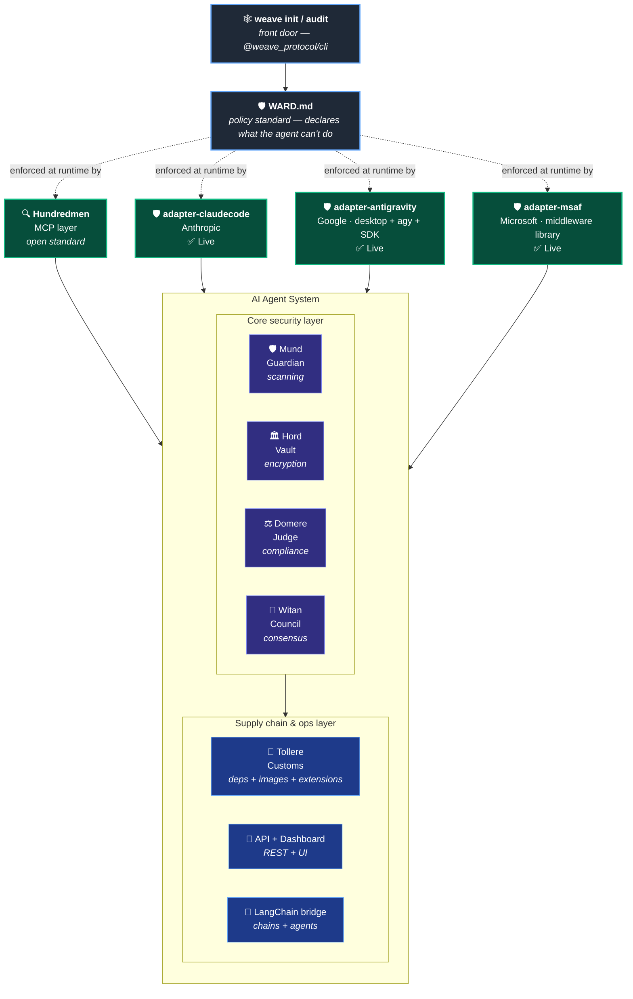

# 🕸️ Weave_Protocol

**Enterprise Security Suite for AI Agents**

[](https://www.npmjs.com/package/@weave_protocol/cli) [](https://www.npmjs.com/package/@weave_protocol/cli) [](https://www.npmjs.com/package/@weave_protocol/full) [](https://www.npmjs.com/package/@weave_protocol/full) [](https://www.npmjs.com/package/@weave_protocol/ward) [](https://www.npmjs.com/package/@weave_protocol/ward) [](https://www.npmjs.com/package/@weave_protocol/adapter-claudecode) [](https://www.npmjs.com/package/@weave_protocol/adapter-claudecode) [](https://www.npmjs.com/package/@weave_protocol/adapter-antigravity) [](https://www.npmjs.com/package/@weave_protocol/adapter-antigravity) [](https://www.npmjs.com/package/@weave_protocol/adapter-msaf) [](https://www.npmjs.com/package/@weave_protocol/adapter-msaf) [](https://www.npmjs.com/package/@weave_protocol/mund) [](https://www.npmjs.com/package/@weave_protocol/mund) [](https://www.npmjs.com/package/@weave_protocol/hord) [](https://www.npmjs.com/package/@weave_protocol/hord) [](https://www.npmjs.com/package/@weave_protocol/domere) [](https://www.npmjs.com/package/@weave_protocol/domere) [](https://www.npmjs.com/package/@weave_protocol/witan) [](https://www.npmjs.com/package/@weave_protocol/witan) [](https://www.npmjs.com/package/@weave_protocol/hundredmen) [](https://www.npmjs.com/package/@weave_protocol/hundredmen) [](https://www.npmjs.com/package/@weave_protocol/tollere) [](https://www.npmjs.com/package/@weave_protocol/tollere) [](https://www.npmjs.com/package/@weave_protocol/langchain) [](https://www.npmjs.com/package/@weave_protocol/langchain) [](https://www.npmjs.com/package/@weave_protocol/api) [](https://www.npmjs.com/package/@weave_protocol/api) [](https://opensource.org/licenses/Apache-2.0)

Make agent orchestration verifiable and auditable. Cryptographically verify multi-agent behavior, detect threats in real-time, and maintain compliance across any platform. Built as a TypeScript monorepo with MCP integration and blockchain anchoring.

---

## 🌐 Operator Dashboard

```
npx @weave_protocol/api
# → http://localhost:3000/dashboard
```

Live monitoring across all five enforcement surfaces in one view. The dashboard renders WARD.md at the top of a hierarchy diagram, fanning out to your configured enforcers (Hundredmen + the three vendor adapters + browser). Surfaces you're not using appear dimmed, so it's instantly clear what's protecting your agent versus what's available.

Includes a live activity feed (allows / denies / IPI detections / approvals across all surfaces), a WARD policy panel (current rule counts and behavioral limits), and 24-hour aggregate stats. Auto-refreshes every 5 seconds. Monochrome design — built for ops rooms, not marketing decks.

## 🚀 Get started in one command

```
npx @weave_protocol/cli init
```

The CLI detects your framework (LangChain, LlamaIndex, MCP, OpenAI, Anthropic), asks which Weave Protocol packages you want, and scaffolds the right security middleware for your stack. Or install everything at once:

```
npm install @weave_protocol/full
```

---

## 🆕 What's New

### 🛡️ Four runtimes. Three vendors. One policy file.

The thesis was that [WARD.md](https://www.npmjs.com/package/@weave_protocol/ward) could be a **portable agent security standard** — write it once, enforce it everywhere. As of today, that's **shipped and live across the entire agent harness landscape**:

| Runtime                                            | Vendor        | Enforcer                                                                             | Status        |
| -------------------------------------------------- | ------------- | ------------------------------------------------------------------------------------ | ------------- |
| **MCP servers**                                    | Open standard | [Hundredmen v1.1.0](https://github.com/Tyox-all/Weave_Protocol/blob/main/hundredmen)                   | ✅ Live on npm |
| **Claude Code**                                    | Anthropic     | [adapter-claudecode v0.1.0](https://github.com/Tyox-all/Weave_Protocol/blob/main/adapter-claudecode)   | ✅ Live on npm |
| **Google Antigravity** (desktop + `agy` CLI + SDK) | Google        | [adapter-antigravity v0.1.0](https://github.com/Tyox-all/Weave_Protocol/blob/main/adapter-antigravity) | ✅ Live on npm |
| **Microsoft Agent Framework**                      | Microsoft     | [adapter-msaf v0.1.0](https://github.com/Tyox-all/Weave_Protocol/blob/main/adapter-msaf)               | ✅ Live on npm |

The same `WARD.md` file in your project root is now read and enforced by **Anthropic's, Google's, Microsoft's, and MCP's runtimes** — without any platform-specific edits. That's the standard working in production.

```
my-agent-project/
├── AGENTS.md          # what the agent does
├── SKILL.md           # how the agent does it
└── WARD.md            # what the agent can't do  ← all four runtimes respect this
```

---

### 🛡️ Microsoft Agent Framework adapter v0.1.0 — third cross-platform adapter

[`@weave_protocol/adapter-msaf`](https://github.com/Tyox-all/Weave_Protocol/blob/main/adapter-msaf) enforces WARD.md inside [Microsoft Agent Framework](https://devblogs.microsoft.com/agent-framework/) via the framework's middleware pipeline.

Unlike the Claude Code and Antigravity adapters which use config-file hooks, MSAF middleware is **registered programmatically in user code**. So this adapter is primarily a **library** with a supporting CLI:

```
import { WardMiddleware } from '@weave_protocol/adapter-msaf';

const ward = new WardMiddleware();   // auto-loads ./WARD.md
agent.useFunctionMiddleware(ward.functionMiddleware());
```

One line. Every tool call your MSAF agent makes is now gated by your WARD.md.

20 built-in tool mappings cover MSAF's local runtime tools, Copilot SDK patterns, and Claude Code SDK integration names. Bash command heuristic catches **Azure credential paths** on top of SSH/AWS/GCP. Typed `WardDeniedError` exception lets you catch WARD denials cleanly. `onAllow` / `onDeny` callbacks support logging, attestation, and emergency override.

**[See adapter-msaf README →](https://github.com/Tyox-all/Weave_Protocol/blob/main/adapter-msaf)**

---

### 🛡️ Google Antigravity adapter v0.1.0 — second cross-platform adapter

[`@weave_protocol/adapter-antigravity`](https://github.com/Tyox-all/Weave_Protocol/blob/main/adapter-antigravity) enforces WARD.md inside [Google Antigravity](https://antigravity.google/) via the `PreToolUse` hook system shared across Antigravity 2.0 desktop, the `agy` CLI, and the Antigravity SDK. **One hook install protects all three Antigravity surfaces** because they share the same agent harness with synced settings.

```
npm install -g @weave_protocol/adapter-antigravity
weave-antigravity init
```

Bash command heuristic catches GCP credential paths on top of the SSH/AWS standards.

**[See adapter-antigravity README →](https://github.com/Tyox-all/Weave_Protocol/blob/main/adapter-antigravity)**

---

### 🛡️ Claude Code adapter v0.1.0 — first cross-platform harness adapter

[`@weave_protocol/adapter-claudecode`](https://github.com/Tyox-all/Weave_Protocol/blob/main/adapter-claudecode) enforces WARD.md policies inside [Claude Code](https://docs.anthropic.com/en/docs/claude-code) via its native `PreToolUse` hook system.

```
npm install -g @weave_protocol/adapter-claudecode
weave-claude-code init
npx @weave_protocol/ward init
# Every Claude Code tool call is now gated by your WARD.md
```

**[See adapter-claudecode README →](https://github.com/Tyox-all/Weave_Protocol/blob/main/adapter-claudecode)**

---

### 🔍 Hundredmen v1.1.0 — WARD.md enforcement at the MCP layer

[Hundredmen](https://github.com/Tyox-all/Weave_Protocol/blob/main/hundredmen) reads `WARD.md` and enforces it at the MCP interception layer. WARD becomes the **first gate** in Hundredmen's decision flow — ahead of reputation, drift, and approval checks.

```
🔍 Weave Hundredmen MCP Server running
🛡️  WARD.md loaded from ./WARD.md (My Agent Security Policy)
```

```
{
  "decision": "auto_blocked",
  "decisionReason": "WARD: Tool 'shell_exec' is in the deny list."
}
```

**[See Hundredmen README →](https://github.com/Tyox-all/Weave_Protocol/blob/main/hundredmen)**

---

### 🛡️ WARD.md v0.1.0 — Agent Security Policy Standard

> *AGENTS.md tells your agent what to do. SKILL.md tells your agent how to do it. **WARD.md tells your agent what it can't.***

Agents are now infrastructure-as-code. They're defined in markdown files (`AGENTS.md`, `SKILL.md`), version-controlled, and shared across registries. **WARD.md** is the third file in that stack — a portable, declarative format for declaring the security policy of an AI agent.

```
npx @weave_protocol/ward init             # create a starter WARD.md
npx @weave_protocol/ward validate WARD.md # validate it (use in CI)
npx @weave_protocol/ward explain WARD.md  # human-readable policy summary
```

A WARD.md file declares ten policy domains: filesystem rules, network allowlists, capability gating, data egress boundaries, behavioral limits (iterations / runtime / cost / tokens), multi-agent trust chains, compliance frameworks, attestation requirements, threat model, and incident response. The format is portable across harness platforms — and now proven so across four runtimes.

**[See Ward README →](https://github.com/Tyox-all/Weave_Protocol/blob/main/ward)** · **[See the WARD.md spec →](https://github.com/Tyox-all/Weave_Protocol/blob/main/ward/SPEC.md)**

---

### 🕸️ Weave CLI v0.1.0 + Full Bundle v0.1.0

The **`weave`** command-line tool is live. One command sets up framework-specific security middleware.

**[See CLI README →](https://github.com/Tyox-all/Weave_Protocol/blob/main/cli)** · **[See Full README →](https://github.com/Tyox-all/Weave_Protocol/blob/main/full)**

---

### 🛂 Tollere v0.2.2 — Multi-Channel Supply Chain Security

> *Old English `tollere` — the customs inspector who stood at the gate and examined every good crossing the boundary.*

Catches typosquats, CVEs, compromised maintainers, **Docker tag overwriting**, **IDE extension impersonation**, and **sandwich-pattern attacks** before the install completes. Validated against the real-world Checkmarx KICS supply chain compromise (April 2026).

**Coverage:** npm, PyPI, Cargo, Go, Maven, Docker Hub, VS Code Marketplace (covers Cursor + Windsurf), Open VSX (VSCodium/Gitpod), JetBrains Marketplace.

**[See Tollere README →](https://github.com/Tyox-all/Weave_Protocol/blob/main/tollere)**

---

### 📊 Web Dashboard, Python/LlamaIndex, and LangChain.js integrations

Also shipped:

- **Web Dashboard** (API v1.0.12) — live activity feed, threat intel, compliance, MCP reputation. `npx @weave_protocol/api` → http://localhost:3000/dashboard
- **Python/LlamaIndex** (`weave-protocol-llamaindex`) — drop-in security callbacks for LlamaIndex
- **LangChain.js** (`@weave_protocol/langchain`) — `WeaveSecurityCallback` for any chain or agent

---

## 📦 Packages

| Package                                                                                           | Version   | Description                                                                                |
| ------------------------------------------------------------------------------------------------- | --------- | ------------------------------------------------------------------------------------------ |
| [🕸️ @weave_protocol/cli](https://github.com/Tyox-all/Weave_Protocol/blob/main/cli)                                 | 0.1.0     | **The `weave` CLI** — `init`, `audit`, `dashboard`, `doctor`                               |
| [📦 @weave_protocol/full](https://github.com/Tyox-all/Weave_Protocol/blob/main/full)                                | 0.1.0     | **Bundle** — installs all packages in one command                                          |
| [🛡️ @weave_protocol/ward](https://github.com/Tyox-all/Weave_Protocol/blob/main/ward)                               | 0.1.0     | **WARD.md** — agent security policy standard (parser, validator, runtime checks)           |
| [🛡️ @weave_protocol/adapter-claudecode](https://github.com/Tyox-all/Weave_Protocol/blob/main/adapter-claudecode)   | 0.1.0     | **Claude Code adapter** — enforces WARD.md via PreToolUse hooks                            |
| [🛡️ @weave_protocol/adapter-antigravity](https://github.com/Tyox-all/Weave_Protocol/blob/main/adapter-antigravity) | 0.1.0     | **Google Antigravity adapter** — enforces WARD.md across desktop, `agy` CLI, and SDK       |
| [🛡️ @weave_protocol/adapter-msaf](https://github.com/Tyox-all/Weave_Protocol/blob/main/adapter-msaf)               | **0.1.0** | **🆕 Microsoft Agent Framework adapter** — middleware-based WARD enforcement                |
| [🛡️ @weave_protocol/mund](https://github.com/Tyox-all/Weave_Protocol/blob/main/mund)                               | 0.2.2     | Security scanner — secrets, PII, injection, MCP vetting, threat intel                      |
| [🏛️ @weave_protocol/hord](https://github.com/Tyox-all/Weave_Protocol/blob/main/hord)                               | 0.1.6     | Encrypted vault with Yoxallismus cipher                                                    |
| [⚖️ @weave_protocol/domere](https://github.com/Tyox-all/Weave_Protocol/blob/main/domere)                           | 1.3.4     | Compliance (PCI-DSS, ISO27001, SOC2, HIPAA, GDPR, CCPA) & verification                     |
| [👥 @weave_protocol/witan](https://github.com/Tyox-all/Weave_Protocol/blob/main/witan)                              | 1.0.2     | Multi-agent consensus & governance                                                         |
| [🔍 @weave_protocol/hundredmen](https://github.com/Tyox-all/Weave_Protocol/blob/main/hundredmen)                    | 1.1.0     | **Real-time MCP proxy** — intercept, scan, gate tool calls, **enforces WARD.md**           |
| [🛂 @weave_protocol/tollere](https://github.com/Tyox-all/Weave_Protocol/blob/main/tollere)                          | 0.2.2     | **Supply chain security** — npm, Docker images, IDE extensions, sandwich pattern detection |
| [🔗 @weave_protocol/langchain](https://github.com/Tyox-all/Weave_Protocol/blob/main/langchain)                      | 1.0.1     | **LangChain.js** security callbacks & tool wrappers                                        |
| [🐍 weave-protocol-llamaindex](https://github.com/Tyox-all/Weave_Protocol/blob/main/llamaindex-py)                   | 0.1.0     | **Python/LlamaIndex** security callbacks & tools                                           |
| [🔌 @weave_protocol/api](https://github.com/Tyox-all/Weave_Protocol/blob/main/api)                                  | 1.0.12    | REST API for all packages + **dashboard**                                                  |

---

## 🤖 AI Agent Skills

Each package includes a `SKILL.md` file following the [Claude Agent Skills specification](https://docs.anthropic.com/en/docs/claude-code/skills). These teach AI agents how to use Weave Protocol tools effectively.

| Package                | Skill Name              | Triggers                                                                                        |
| ---------------------- | ----------------------- | ----------------------------------------------------------------------------------------------- |
| 🕸️ CLI                 | `weave-cli`             | set up Weave, init project, scaffold security, audit, dashboard, doctor                         |
| 🛡️ Ward                | `ward`                  | WARD.md, agent security policy, guardrails, lock down agent, define boundaries                  |
| 🛡️ adapter-claudecode  | `adapter-claudecode`    | secure Claude Code, install WARD hooks, block Claude Code actions                               |
| 🛡️ adapter-antigravity | `adapter-antigravity`   | secure Antigravity, agy hooks, block GCP credential reads, lock down managed agents             |
| 🛡️ adapter-msaf        | `adapter-msaf`          | secure MSAF agent, WardMiddleware, lock down Copilot SDK, Azure agent enforcement               |
| 🛡️ Mund                | `security-scanning`     | scan, detect secrets, check injection, vet MCP server, threat intel                             |
| 🏛️ Hord                | `encrypting-data`       | encrypt, decrypt, vault, Yoxallismus, protect                                                   |
| ⚖️ Domere              | `compliance-auditing`   | audit, checkpoint, SOC2, HIPAA, PCI-DSS, GDPR, CCPA, blockchain                                 |
| 👥 Witan                | `consensus-governance`  | consensus, vote, approve, policy, escalate                                                      |
| 🔍 Hundredmen           | `security-inspection`   | intercept, drift, reputation, approve, block, live feed, enforce WARD policy                    |
| 🛂 Tollere              | `supply-chain-security` | npm install, docker pull, install extension, dependency check, typosquat, CVE, sandwich pattern |
| 🔗 Langchain            | `langchain-security`    | LangChain, callback, secure tool, RAG security, PII redaction                                   |
| 🔌 API                  | `weave-api-calling`     | REST API, HTTP endpoint, curl, fetch                                                            |

**Installation:**

The SKILL.md format is shared across Claude Code and Antigravity (both inherited from the original Anthropic spec), so the same files work for both platforms — only the install path differs.

```
git clone https://github.com/Tyox-all/Weave_Protocol.git
cd Weave_Protocol

# For Claude Code:
mkdir -p ~/.claude/skills/weave-protocol
cp */SKILL.md ~/.claude/skills/weave-protocol/

# For Google Antigravity (global, all sessions):
mkdir -p ~/.gemini/antigravity-cli/skills/weave-protocol
cp */SKILL.md ~/.gemini/antigravity-cli/skills/weave-protocol/

# Or per-project under .agents/:
mkdir -p .agents/skills/weave-protocol
cp /path/to/Weave_Protocol/*/SKILL.md .agents/skills/weave-protocol/
```

For **Microsoft Agent Framework**, skills aren't used — MSAF is code-level. Use the `WardMiddleware` class from `@weave_protocol/adapter-msaf` instead (see [adapter-msaf README](https://github.com/Tyox-all/Weave_Protocol/blob/main/adapter-msaf)).

Once installed, the agent automatically invokes the appropriate skill for each task.

---

## 🚀 Quick Start

### Option 1: Guided setup (recommended)

```
npx @weave_protocol/cli init
```

### Option 2: Install everything

```
npm install @weave_protocol/full
```

### Option 3: Install individual packages

```
npm install @weave_protocol/mund @weave_protocol/tollere @weave_protocol/ward
```

### Claude Desktop Integration (MCP)

Add to `claude_desktop_config.json`:

```
{
  "mcpServers": {
    "mund":       { "command": "npx", "args": ["-y", "@weave_protocol/mund"] },
    "hord":       { "command": "npx", "args": ["-y", "@weave_protocol/hord"] },
    "domere":     { "command": "npx", "args": ["-y", "@weave_protocol/domere"] },
    "hundredmen": { "command": "npx", "args": ["-y", "@weave_protocol/hundredmen"] },
    "tollere":    { "command": "npx", "args": ["-y", "@weave_protocol/tollere"] }
  }
}
```

If you have a `WARD.md` in your home directory or set `$WEAVE_WARD_PATH`, Hundredmen will auto-enforce it.

### Claude Code Integration

```
npm install -g @weave_protocol/adapter-claudecode
weave-claude-code init
```

### Google Antigravity Integration

```
npm install -g @weave_protocol/adapter-antigravity
weave-antigravity init
```

### Microsoft Agent Framework Integration

```
npm install @weave_protocol/adapter-msaf
```

```
import { WardMiddleware } from '@weave_protocol/adapter-msaf';
const ward = new WardMiddleware();
agent.useFunctionMiddleware(ward.functionMiddleware());
```

Drop a `WARD.md` in your project root. Any (or all!) of the adapters will gate every tool call.

---

## ✨ Package Details

### 🕸️ CLI — One Command for Everything

```
npx @weave_protocol/cli init        # detect framework, scaffold middleware
npx @weave_protocol/cli audit       # supply chain scan (Tollere)
npx @weave_protocol/cli dashboard   # launch monitoring UI
npx @weave_protocol/cli doctor      # environment health check
```

📄 **Skill:** [`weave-cli`](https://github.com/Tyox-all/Weave_Protocol/blob/main/cli/SKILL.md)

---

### 🛡️ Ward — The Policy Standard

WARD.md files declare what an agent is allowed to do, version-controlled alongside `AGENTS.md` and `SKILL.md`.

| Section               | Controls                                                        |
| --------------------- | --------------------------------------------------------------- |
| **Filesystem**        | Read/write/execute/delete/list rules with glob patterns         |
| **Network**           | Outbound HTTP allowlist with optional method restrictions       |
| **Capabilities**      | Tools the agent may invoke (with optional approval gating)      |
| **Data Boundaries**   | Egress classifications (PII, PHI, credentials...) and redaction |
| **Behavioral Limits** | Iterations, runtime, cost, tokens, tool calls                   |
| **Multi-Agent**       | Trust chain, isolation level, semantic drift threshold          |
| **Compliance**        | SOC2 / HIPAA / GDPR / CCPA / ISO27001 / PCI-DSS                 |
| **Verification**      | Attestation backend (Dōmere), blockchain, frequency             |
| **Threat Model**      | In-scope / out-of-scope threats                                 |
| **Incident Response** | Actions on violation (log / alert / terminate / attest)         |

Enforced at runtime by four independent enforcers:

- **Hundredmen** (MCP layer)
- **adapter-claudecode** (Claude Code PreToolUse hooks)
- **adapter-antigravity** (Antigravity PreToolUse hooks — desktop + `agy` + SDK)
- **adapter-msaf** (MSAF middleware pipeline — function and agent layers)

📄 **Skill:** [`ward`](https://github.com/Tyox-all/Weave_Protocol/blob/main/ward/SKILL.md) · 📋 **Spec:** [WARD.md SPEC →](https://github.com/Tyox-all/Weave_Protocol/blob/main/ward/SPEC.md)

---

### 🛡️ adapter-claudecode — Claude Code enforcement

```
weave-claude-code init               # install the hook
weave-claude-code status             # show config + active policy
weave-claude-code test Bash --input='{"command":"rm -rf ~/.ssh"}'
weave-claude-code disable            # remove
```

WARD resolution: `$WEAVE_WARD_PATH` → `<cwd>/WARD.md` → `<cwd>/.weave/WARD.md` → `~/.claude/WARD.md` (user-global).

📄 **Skill:** [`adapter-claudecode`](https://github.com/Tyox-all/Weave_Protocol/blob/main/adapter-claudecode/SKILL.md)

---

### 🛡️ adapter-antigravity — Google Antigravity enforcement

```
weave-antigravity init               # install the hook
weave-antigravity status             # show config + active policy
weave-antigravity test Bash --input='{"command":"cat ~/.config/gcloud/credentials.db"}'
weave-antigravity disable            # remove
```

One install protects Antigravity 2.0 desktop, the `agy` CLI, and the Antigravity SDK (they share the same agent harness with synced settings). Bash command heuristic catches GCP credential paths.

📄 **Skill:** [`adapter-antigravity`](https://github.com/Tyox-all/Weave_Protocol/blob/main/adapter-antigravity/SKILL.md)

---

### 🛡️ adapter-msaf — Microsoft Agent Framework enforcement

```
import { WardMiddleware } from '@weave_protocol/adapter-msaf';
const ward = new WardMiddleware();
agent.useFunctionMiddleware(ward.functionMiddleware());
```

Library-first design (MSAF middleware is programmatic, not config-driven). Catches Azure credential paths in Bash commands. Provides typed `WardDeniedError`, plus `onAllow` / `onDeny` callbacks for logging, attestation, and emergency override.

```
weave-msaf init --language=ts        # print integration snippet
weave-msaf status                    # show active WARD policy
weave-msaf test ShellExec --input='{"command":"cat ~/.azure/credentials"}'
```

📄 **Skill:** [`adapter-msaf`](https://github.com/Tyox-all/Weave_Protocol/blob/main/adapter-msaf/SKILL.md)

---

### 🛡️ Mund — The Guardian

Real-time security scanning for AI agents. Catches secrets (30+ patterns), PII, prompt injection, dangerous code, malicious MCP server descriptions. Threat intel auto-updates from community feeds.

📄 **Skill:** [`security-scanning`](https://github.com/Tyox-all/Weave_Protocol/blob/main/mund/SKILL.md)

---

### 🏛️ Hord — The Vault

Encrypted storage with the Yoxallismus dual-tumbler cipher. AES-256-GCM, ChaCha20-Poly1305, Argon2id key derivation, secure memory handling.

📄 **Skill:** [`encrypting-data`](https://github.com/Tyox-all/Weave_Protocol/blob/main/hord/SKILL.md)

---

### ⚖️ Domere — The Judge

Enterprise-grade verification, orchestration, compliance, and audit infrastructure. SOC2, HIPAA, PCI-DSS, ISO27001, GDPR, CCPA. Solana and Ethereum blockchain anchoring for immutable audit trails.

**Blockchain Anchoring:**

- Solana Mainnet: `6g7raTAHU2h331VKtfVtkS5pmuvR8vMYwjGsZF1CUj2o`
- Solana Devnet: `BeCYVJYfbUu3k2TPGmh9VoGWeJwzm2hg2NdtnvbdBNCj`
- Ethereum: `0xAA8b52adD3CEce6269d14C6335a79df451543820`

📄 **Skill:** [`compliance-auditing`](https://github.com/Tyox-all/Weave_Protocol/blob/main/domere/SKILL.md)

---

### 👥 Witan — The Council

Multi-agent consensus and governance. Unanimous, majority, weighted, and quorum protocols. Rule enforcement, escalation, agent bus.

📄 **Skill:** [`consensus-governance`](https://github.com/Tyox-all/Weave_Protocol/blob/main/witan/SKILL.md)

---

### 🔍 Hundredmen — The Watchers

Real-time MCP security proxy. v1.1.0 enforces WARD.md as the first gate in the decision flow, ahead of reputation, drift, and approval checks.

📄 **Skill:** [`security-inspection`](https://github.com/Tyox-all/Weave_Protocol/blob/main/hundredmen/SKILL.md)

---

### 🛂 Tollere — The Customs Inspector

Supply chain security for AI-generated code. Catches malicious packages, Docker images, and IDE extensions **before** they reach `node_modules/`, your container, or your editor.

📄 **Skill:** [`supply-chain-security`](https://github.com/Tyox-all/Weave_Protocol/blob/main/tollere/SKILL.md)

---

### 🔗 Langchain — The Bridge

Security integration for LangChain.js applications. Drop-in callbacks, secured tool wrappers, RAG retriever scanning with PII redaction.

📄 **Skill:** [`langchain-security`](https://github.com/Tyox-all/Weave_Protocol/blob/main/langchain/SKILL.md)

---

## 🏗️ Architecture



---

## 🔐 Security Model

Defense-in-depth across the entire AI agent lifecycle:

1. **🛡️ Ward** declares what the agent can and can't do (policy-as-code)
2. **🛡️ Harness adapters** enforce WARD inside the IDE / CLI / framework:
  - `adapter-claudecode` for Claude Code (PreToolUse hooks)
  - `adapter-antigravity` for Google Antigravity (PreToolUse hooks across desktop/CLI/SDK)
  - `adapter-msaf` for Microsoft Agent Framework (middleware pipeline)
3. **🛂 Tollere** inspects every dependency, image, and extension before it enters your project
4. **🛡️ Mund** scans all inputs for threats before processing
5. **🏛️ Hord** encrypts sensitive data at rest and in transit
6. **⚖️ Domere** logs all actions with tamper-evident checksums
7. **👥 Witan** requires consensus for high-risk operations
8. **🔍 Hundredmen** intercepts and gates tool calls in real-time — enforcing WARD policy at the MCP layer
9. **🔗 Langchain** secures LangChain.js chains and agents

### CORS Model Integration

| CORS Layer                           | Weave Package          | Function                                                                     |
| ------------------------------------ | ---------------------- | ---------------------------------------------------------------------------- |
| **Policy**                           | 🛡️ Ward                | Declares allowed/denied actions, behavioral limits, attestation requirements |
| **Policy Enforcement (Claude Code)** | 🛡️ adapter-claudecode  | Reads WARD, gates Claude Code tool calls via hooks                           |
| **Policy Enforcement (Antigravity)** | 🛡️ adapter-antigravity | Reads WARD, gates Antigravity calls across desktop/CLI/SDK                   |
| **Policy Enforcement (MSAF)**        | 🛡️ adapter-msaf        | Reads WARD, gates Microsoft Agent Framework calls via middleware             |
| **Policy Enforcement (MCP)**         | 🔍 Hundredmen           | Reads WARD, gates tool calls at the MCP layer                                |
| **Supply Chain**                     | 🛂 Tollere              | Vets dependencies, images, extensions before install                         |
| **Origin Validation**                | 🛡️ Mund                | Validates input sources, detects injection                                   |
| **Context Integrity**                | 🏛️ Hord                | Protects data integrity through encryption                                   |
| **Deterministic Enforcement**        | ⚖️ Domere              | Ensures consistent policy application                                        |

---

## 🛠️ Development

```
git clone https://github.com/Tyox-all/Weave_Protocol.git
cd Weave_Protocol

# Build each package
for pkg in mund hord domere witan hundredmen tollere langchain api cli ward \
           adapter-claudecode adapter-antigravity adapter-msaf; do
  (cd $pkg && npm install && npm run build)
done
```

---

## 🗺️ Roadmap

### Shipped

- [x] GDPR compliance framework
- [x] CCPA compliance framework
- [x] MCP server reputation scoring
- [x] Automated threat intelligence updates
- [x] LangChain.js integration package
- [x] Python/LlamaIndex integration
- [x] Web dashboard for monitoring
- [x] Supply chain security (Tollere) — npm, PyPI, Cargo, Go, Maven
- [x] Multi-channel supply chain — Docker images + IDE extensions + sandwich pattern detection
- [x] Bundle package + CLI (`weave init`) — adoption funnel
- [x] WARD.md agent security policy standard
- [x] Hundredmen ↔ WARD enforcement integration (v1.1.0)
- [x] **Claude Code harness adapter** (Anthropic)
- [x] **Google Antigravity harness adapter** (Google)
- [x] **Microsoft Agent Framework harness adapter** (Microsoft)
- [x] **Cross-platform thesis complete — same WARD.md works across all three major vendor harnesses + MCP**

### H2 2026 Q3 — Adoption Quarter

- [x] Browser agent security (`@weave_protocol/browser`)
- [x] Dashboard v2 with orchestration visualization
- [x] **[State of AI Agent Security: Q3 Report](https://tyox-all.github.io/Weave_Protocol/q3-2026.html)** — Industry analysis of agent security trends, platform maturity, supply chain risks, and market gaps

### H2 2026 Q4 — Moat Quarter

- [ ] Adversarial agents (`@weave_protocol/adversary`)
- [ ] Yoxallismus v2 (multi-agent, memory-aware cipher)
- [ ] Witan killer use case: autonomous spending caps
- [ ] AgentSecBench (open benchmark + leaderboard)

---

## 🤝 Contributing

Bug reports and feature requests welcome via [GitHub Issues](https://github.com/Tyox-all/Weave_Protocol/issues).

For security issues, please see [SECURITY.md](https://github.com/Tyox-all/Weave_Protocol/blob/main/SECURITY.md).

For all other inquiries: **<TYox-all@tutamail.com>**

See [CONTRIBUTING.md](https://github.com/Tyox-all/Weave_Protocol/blob/main/CONTRIBUTING.md) for guidelines.

---

## 📄 License

Apache 2.0 — See [LICENSE](https://github.com/Tyox-all/Weave_Protocol/blob/main/LICENSE)

---

## 🔗 Links

- **GitHub:** https://github.com/Tyox-all/Weave_Protocol
- **npm packages:** https://www.npmjs.com/~tyox-all
- **PyPI:** https://pypi.org/project/weave-protocol-llamaindex/
- **MCP Registry:** https://registry.modelcontextprotocol.io (search "mund")

---

*Built with ❤️ for the AI agent ecosystem.*
