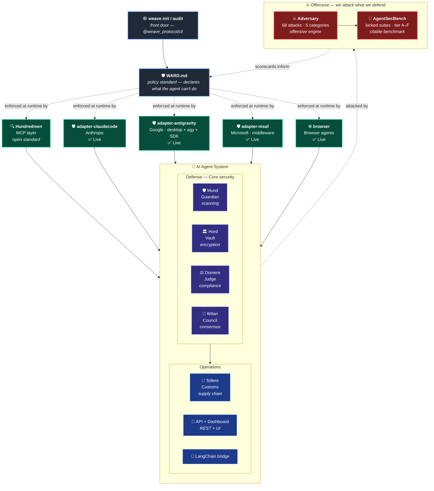

# 🕸️ Weave_Protocol

**Infrastructure security for AI agents. We attack what we defend.**

[](https://www.npmjs.com/package/@weave_protocol/cli)
[](https://www.npmjs.com/package/@weave_protocol/full)
[](https://www.npmjs.com/package/@weave_protocol/ward)
[](https://www.npmjs.com/package/@weave_protocol/adversary)
[](https://www.npmjs.com/package/@weave_protocol/agentsecbench)
[](https://www.npmjs.com/package/@weave_protocol/browser)
[](https://www.npmjs.com/package/@weave_protocol/adapter-claudecode)
[](https://www.npmjs.com/package/@weave_protocol/adapter-antigravity)
[](https://www.npmjs.com/package/@weave_protocol/adapter-msaf)
[](https://www.npmjs.com/package/@weave_protocol/hundredmen)
[](https://www.npmjs.com/package/@weave_protocol/mund)
[](https://www.npmjs.com/package/@weave_protocol/hord)
[](https://www.npmjs.com/package/@weave_protocol/domere)
[](https://www.npmjs.com/package/@weave_protocol/witan)
[](https://www.npmjs.com/package/@weave_protocol/tollere)
[](https://www.npmjs.com/package/@weave_protocol/langchain)
[](https://www.npmjs.com/package/@weave_protocol/api)
[](https://opensource.org/licenses/Apache-2.0)

Make agent behavior verifiable, auditable, and cryptographically provable across any harness, any platform. Built as a TypeScript monorepo with MCP integration, blockchain anchoring, and — as of Q4 — a **published red-team engine that tests our own defenses**.

> **The thesis:** every security platform claims its defenses work. We're the first to publish the attacks that prove it. Same suite. Same scorecard. Same locked benchmark — applied to our own packages, every release.

---

## 🚀 Get started in one command

```bash
npx @weave_protocol/cli init
```

The CLI detects your framework (LangChain, LlamaIndex, MCP, OpenAI, Anthropic, Microsoft, Google) and scaffolds the right security middleware for your stack. Or install everything at once:

```bash
npm install @weave_protocol/full
```

---

## 🆕 What's New

### ⚔️ Q4 Moat Quarter — *we attack what we defend*

The first agent security platform to publish its own offensive engine. Two new packages flipped the suite from purely defensive to **defense + offense in the same monorepo**, validated against each other:

| Package | Role | Version |
|---|---|---|
| [`@weave_protocol/adversary`](https://github.com/Tyox-all/Weave_Protocol/blob/main/adversary) | Offensive engine — 68 documented + novel attacks across 5 categories (IPI, tool-coercion, jailbreak, extraction, goal-corruption) | ✅ v0.1.2 |
| [`@weave_protocol/agentsecbench`](https://github.com/Tyox-all/Weave_Protocol/blob/main/agentsecbench) | Standardized benchmark — locked attack suites, tier grades A–F, paste-ready reports, side-by-side comparison | ✅ v0.1.0 |

**Trophy attacks** — documented in-the-wild incidents reproduced in the corpus:

- 🏦 **Atlan autonomous-fraud** (Dec 2025) — first documented agent-driven financial fraud
- 🔒 **EchoLeak** (CVE-2025-32711) — Microsoft Copilot zero-click exfil
- 👻 **Brave/Comet OTP exfil** (2025) — browser agent secret leak via hidden CSS
- 🚫 **Forcepoint false copyright** (Apr 2026) — DoS via fake copyright claim

```bash
# Run the canonical benchmark against the demo target — proves the suite lands
npx @weave_protocol/agentsecbench run

# Or run the full 68-attack corpus directly
npx @weave_protocol/adversary demo
```

**Why this matters:** every model release, every WARD policy change, every adapter update can be re-benchmarked against the same locked suite. Did your score regress? `agentsecbench compare` will show you. Does your WARD policy actually defend anything? `--measure-ward-delta` will tell you. This is how a category gets defined.

**[See Adversary README →](https://github.com/Tyox-all/Weave_Protocol/blob/main/adversary)** · **[See AgentSecBench README →](https://github.com/Tyox-all/Weave_Protocol/blob/main/agentsecbench)** · **[See METHODOLOGY.md →](https://github.com/Tyox-all/Weave_Protocol/blob/main/agentsecbench/METHODOLOGY.md)**

---

### 🛡️ Four runtimes. Three vendors. One policy file.

The thesis was that [WARD.md](https://www.npmjs.com/package/@weave_protocol/ward) could be a **portable agent security standard** — write it once, enforce it everywhere. As of today, that's **shipped and live across the entire agent harness landscape**:

| Runtime | Vendor | Enforcer | Status |
|---|---|---|---|
| **MCP servers** | Open standard | [Hundredmen v1.1.0](https://github.com/Tyox-all/Weave_Protocol/blob/main/hundredmen) | ✅ Live on npm |
| **Claude Code** | Anthropic | [adapter-claudecode v0.1.0](https://github.com/Tyox-all/Weave_Protocol/blob/main/adapter-claudecode) | ✅ Live on npm |
| **Google Antigravity** (desktop + `agy` CLI + SDK) | Google | [adapter-antigravity v0.1.0](https://github.com/Tyox-all/Weave_Protocol/blob/main/adapter-antigravity) | ✅ Live on npm |
| **Microsoft Agent Framework** | Microsoft | [adapter-msaf v0.1.0](https://github.com/Tyox-all/Weave_Protocol/blob/main/adapter-msaf) | ✅ Live on npm |
| **Browser agents** | Open standard | [browser v0.1.0](https://github.com/Tyox-all/Weave_Protocol/blob/main/browser) | ✅ Live on npm |

The same `WARD.md` file in your project root is now read and enforced by **Anthropic's, Google's, Microsoft's, MCP's, and the browser harness's runtimes** — without any platform-specific edits.

```
my-agent-project/
├── AGENTS.md          # what the agent does
├── SKILL.md           # how the agent does it
└── WARD.md            # what the agent can't do  ← all five surfaces respect this
```

---

### 🌐 Browser agent security (Q3) — fifth enforcement surface

[`@weave_protocol/browser`](https://github.com/Tyox-all/Weave_Protocol/blob/main/browser) adds runtime IPI (indirect prompt injection) scanning to browser-driving agents. 33 detection patterns cover the documented threat surface: hidden CSS payloads, role-hijack directives, tool-call mimicry, action-injection directives, payment-recipient proximity patterns (Atlan), copyright-DoS markers (Forcepoint), and more.

Pair with the [Browser Guard extension](https://github.com/Tyox-all/Weave_Protocol/blob/main/browser-extension) for client-side visibility into what your agent sees vs. what you see.

**[See browser README →](https://github.com/Tyox-all/Weave_Protocol/blob/main/browser)**

---

### 📊 State of AI Agent Security: Q3 2026 Report

Industry analysis of agent security trends, platform maturity, supply chain risks, and market gaps. Live at: **[tyox-all.github.io/Weave_Protocol/q3-2026.html](https://tyox-all.github.io/Weave_Protocol/q3-2026.html)**

---

### Previously shipped (Q3)

- **adapter-msaf v0.1.0** — Microsoft Agent Framework enforcement via middleware. `WardMiddleware` class, one-line integration, Azure credential heuristic.
- **adapter-antigravity v0.1.0** — Google Antigravity enforcement. One install protects desktop + `agy` CLI + SDK.
- **adapter-claudecode v0.1.0** — Claude Code enforcement via PreToolUse hooks.
- **Hundredmen v1.1.0** — WARD.md is now the first gate in the MCP decision flow, ahead of reputation/drift/approval.
- **WARD.md v0.1.0** — Agent security policy standard. Ten domains: filesystem, network, capabilities, data boundaries, behavioral limits, multi-agent, compliance, verification, threat model, incident response. [Spec →](https://github.com/Tyox-all/Weave_Protocol/blob/main/ward/SPEC.md)
- **Tollere v0.2.2** — Multi-channel supply chain security. npm, PyPI, Cargo, Go, Maven, Docker Hub, VS Code Marketplace, Open VSX, JetBrains. Sandwich pattern detection.
- **Weave CLI v0.1.0 + Full Bundle v0.1.0** — `weave init` / `audit` / `dashboard` / `doctor`. One-command security setup.

---

## 📦 Packages

The suite is now organized into three layers — **defense**, **offensive**, and **operations**. All 17 packages live on npm under the `@weave_protocol` scope, plus one Python package on PyPI.

### 🛡️ Defense Layer (11 packages)

The packages that keep your agent within policy: declare it, enforce it across every harness, scan everything that enters, encrypt everything that exits.

| Package | Version | Description |
|---|---|---|
| [🛡️ @weave_protocol/ward](https://github.com/Tyox-all/Weave_Protocol/blob/main/ward) | 0.1.0 | **WARD.md** — agent security policy standard (parser, validator, runtime checks) |
| [🛡️ @weave_protocol/adapter-claudecode](https://github.com/Tyox-all/Weave_Protocol/blob/main/adapter-claudecode) | 0.1.0 | **Claude Code adapter** — enforces WARD.md via PreToolUse hooks |
| [🛡️ @weave_protocol/adapter-antigravity](https://github.com/Tyox-all/Weave_Protocol/blob/main/adapter-antigravity) | 0.1.0 | **Google Antigravity adapter** — enforces WARD.md across desktop, `agy` CLI, and SDK |
| [🛡️ @weave_protocol/adapter-msaf](https://github.com/Tyox-all/Weave_Protocol/blob/main/adapter-msaf) | 0.1.0 | **Microsoft Agent Framework adapter** — middleware-based WARD enforcement |
| [🌐 @weave_protocol/browser](https://github.com/Tyox-all/Weave_Protocol/blob/main/browser) | 0.1.0 | **Browser agent security** — runtime IPI scanner (33 patterns) for headless agents |
| [🔍 @weave_protocol/hundredmen](https://github.com/Tyox-all/Weave_Protocol/blob/main/hundredmen) | 1.1.0 | **MCP proxy** — intercept, scan, gate tool calls; enforces WARD.md as first gate |
| [🛡️ @weave_protocol/mund](https://github.com/Tyox-all/Weave_Protocol/blob/main/mund) | 0.2.2 | **Scanner** — secrets, PII, injection, MCP vetting, threat intel |
| [🏛️ @weave_protocol/hord](https://github.com/Tyox-all/Weave_Protocol/blob/main/hord) | 0.1.6 | **Vault** — encrypted storage with Yoxallismus dual-tumbler cipher |
| [⚖️ @weave_protocol/domere](https://github.com/Tyox-all/Weave_Protocol/blob/main/domere) | 1.3.4 | **Judge** — compliance (PCI-DSS, ISO27001, SOC2, HIPAA, GDPR, CCPA), blockchain anchoring |
| [👥 @weave_protocol/witan](https://github.com/Tyox-all/Weave_Protocol/blob/main/witan) | 1.0.2 | **Council** — multi-agent consensus & governance |
| [🛂 @weave_protocol/tollere](https://github.com/Tyox-all/Weave_Protocol/blob/main/tollere) | 0.2.2 | **Customs** — supply chain security (npm, PyPI, Docker, IDE extensions, sandwich detection) |

### ⚔️ Offensive Layer (2 packages) — **NEW Q4**

The red team. We attack what we defend.

| Package | Version | Description |
|---|---|---|
| [⚔️ @weave_protocol/adversary](https://github.com/Tyox-all/Weave_Protocol/blob/main/adversary) | **0.1.2** | **Offensive engine** — 68 documented + novel attacks across 5 categories. WARD-aware attack selection. Locked v1.0 scorecard schema |
| [🎯 @weave_protocol/agentsecbench](https://github.com/Tyox-all/Weave_Protocol/blob/main/agentsecbench) | **0.1.0** | **Standardized benchmark** — locked suites (ASB-Browser-v1), tier grading A–F, trophy attacks, WARD delta, paste-ready reports |

### 🔧 Operations & Integrations (5 packages, plus 1 PyPI)

The front door, the dashboard, the bridges to other frameworks.

| Package | Version | Description |
|---|---|---|
| [🕸️ @weave_protocol/cli](https://github.com/Tyox-all/Weave_Protocol/blob/main/cli) | 0.1.0 | **The `weave` CLI** — `init`, `audit`, `dashboard`, `doctor` |
| [📦 @weave_protocol/full](https://github.com/Tyox-all/Weave_Protocol/blob/main/full) | 0.1.0 | **Bundle** — installs all packages in one command |
| [🔌 @weave_protocol/api](https://github.com/Tyox-all/Weave_Protocol/blob/main/api) | 1.1.1 | **REST API + Operator Dashboard** — `npx @weave_protocol/api` → http://localhost:3000/dashboard |
| [🔗 @weave_protocol/langchain](https://github.com/Tyox-all/Weave_Protocol/blob/main/langchain) | 1.0.1 | **LangChain.js** security callbacks & tool wrappers |
| [🐍 weave-protocol-llamaindex](https://github.com/Tyox-all/Weave_Protocol/blob/main/llamaindex-py) | 0.1.0 | **Python/LlamaIndex** security callbacks & tools (on PyPI) |

---

## 🤖 AI Agent Skills

Each package includes a `SKILL.md` file following the [Claude Agent Skills specification](https://docs.anthropic.com/en/docs/claude-code/skills). These teach AI agents how to use Weave Protocol tools effectively.

| Package | Skill Name | Triggers |
|---|---|---|
| 🕸️ CLI | `weave-cli` | set up Weave, init project, scaffold security, audit, dashboard, doctor |
| 🛡️ Ward | `ward` | WARD.md, agent security policy, guardrails, lock down agent |
| 🛡️ adapter-claudecode | `adapter-claudecode` | secure Claude Code, install WARD hooks, block Claude Code actions |
| 🛡️ adapter-antigravity | `adapter-antigravity` | secure Antigravity, agy hooks, block GCP credential reads |
| 🛡️ adapter-msaf | `adapter-msaf` | secure MSAF agent, WardMiddleware, lock down Copilot SDK, Azure enforcement |
| 🌐 browser | `browser-security` | secure browser agent, IPI scanning, hidden CSS detection, page-context safety |
| 🛡️ Mund | `security-scanning` | scan, detect secrets, check injection, vet MCP server, threat intel |
| 🏛️ Hord | `encrypting-data` | encrypt, decrypt, vault, Yoxallismus, protect |
| ⚖️ Domere | `compliance-auditing` | audit, checkpoint, SOC2, HIPAA, PCI-DSS, GDPR, CCPA, blockchain |
| 👥 Witan | `consensus-governance` | consensus, vote, approve, policy, escalate |
| 🔍 Hundredmen | `security-inspection` | intercept, drift, reputation, approve, block, live feed, enforce WARD |
| 🛂 Tollere | `supply-chain-security` | npm install, docker pull, install extension, typosquat, CVE, sandwich pattern |
| ⚔️ Adversary | `adversarial-testing` | red-team agent, attack, penetration test, find vulnerabilities, IPI test, run attack corpus |
| 🎯 AgentSecBench | `security-benchmarking` | benchmark agent, security score, tier grade, ASB-Browser, citable security report, compare runs |
| 🔗 Langchain | `langchain-security` | LangChain, callback, secure tool, RAG security, PII redaction |
| 🔌 API | `weave-api-calling` | REST API, HTTP endpoint, curl, fetch |

**Installation:**

The SKILL.md format is shared across Claude Code and Antigravity, so the same files work for both — only the install path differs.

```bash
git clone https://github.com/Tyox-all/Weave_Protocol.git
cd Weave_Protocol

# For Claude Code:
mkdir -p ~/.claude/skills/weave-protocol
cp */SKILL.md ~/.claude/skills/weave-protocol/

# For Google Antigravity (global, all sessions):
mkdir -p ~/.gemini/antigravity-cli/skills/weave-protocol
cp */SKILL.md ~/.gemini/antigravity-cli/skills/weave-protocol/

# Or per-project under .agents/:
mkdir -p .agents/skills/weave-protocol
cp /path/to/Weave_Protocol/*/SKILL.md .agents/skills/weave-protocol/
```

For **Microsoft Agent Framework**, skills aren't used — MSAF is code-level. Use the `WardMiddleware` class from `@weave_protocol/adapter-msaf` instead.

---

## 🚀 Quick Start

### Option 1: Guided setup (recommended)

```bash
npx @weave_protocol/cli init
```

### Option 2: Install everything

```bash
npm install @weave_protocol/full
```

### Option 3: Install individual packages

```bash
npm install @weave_protocol/mund @weave_protocol/tollere @weave_protocol/ward
```

### Option 4: Benchmark first, defend second

```bash
# See what attacks land on your agent before you start hardening
npx @weave_protocol/agentsecbench run --measure-ward-delta
```

### Claude Desktop Integration (MCP)

Add to `claude_desktop_config.json`:

```json
{
  "mcpServers": {
    "mund":       { "command": "npx", "args": ["-y", "@weave_protocol/mund"] },
    "hord":       { "command": "npx", "args": ["-y", "@weave_protocol/hord"] },
    "domere":     { "command": "npx", "args": ["-y", "@weave_protocol/domere"] },
    "hundredmen": { "command": "npx", "args": ["-y", "@weave_protocol/hundredmen"] },
    "tollere":    { "command": "npx", "args": ["-y", "@weave_protocol/tollere"] }
  }
}
```

### Claude Code / Antigravity / MSAF Integration

```bash
# Anthropic
npm install -g @weave_protocol/adapter-claudecode && weave-claude-code init

# Google
npm install -g @weave_protocol/adapter-antigravity && weave-antigravity init

# Microsoft (code-level)
npm install @weave_protocol/adapter-msaf
```

```typescript
import { WardMiddleware } from '@weave_protocol/adapter-msaf';
const ward = new WardMiddleware();
agent.useFunctionMiddleware(ward.functionMiddleware());
```

Drop a `WARD.md` in your project root. Any (or all) of the adapters will gate every tool call.

---

## ✨ Package Details

### 🕸️ CLI — One Command for Everything

```bash
npx @weave_protocol/cli init        # detect framework, scaffold middleware
npx @weave_protocol/cli audit       # supply chain scan (Tollere)
npx @weave_protocol/cli dashboard   # launch monitoring UI
npx @weave_protocol/cli doctor      # environment health check
```

📄 **Skill:** [`weave-cli`](https://github.com/Tyox-all/Weave_Protocol/blob/main/cli/SKILL.md)

---

### 🛡️ Ward — The Policy Standard

WARD.md files declare what an agent is allowed to do, version-controlled alongside `AGENTS.md` and `SKILL.md`.

| Section | Controls |
|---|---|
| **Filesystem** | Read/write/execute/delete/list rules with glob patterns |
| **Network** | Outbound HTTP allowlist with optional method restrictions |
| **Capabilities** | Tools the agent may invoke (with optional approval gating) |
| **Data Boundaries** | Egress classifications (PII, PHI, credentials...) and redaction |
| **Behavioral Limits** | Iterations, runtime, cost, tokens, tool calls |
| **Multi-Agent** | Trust chain, isolation level, semantic drift threshold |
| **Compliance** | SOC2 / HIPAA / GDPR / CCPA / ISO27001 / PCI-DSS |
| **Verification** | Attestation backend (Dōmere), blockchain, frequency |
| **Threat Model** | In-scope / out-of-scope threats |
| **Incident Response** | Actions on violation (log / alert / terminate / attest) |

Enforced at runtime by five independent surfaces: Hundredmen (MCP), adapter-claudecode (Claude Code), adapter-antigravity (Antigravity), adapter-msaf (Microsoft Agent Framework), and browser (Browser agents).

📄 **Skill:** [`ward`](https://github.com/Tyox-all/Weave_Protocol/blob/main/ward/SKILL.md) · 📋 **Spec:** [WARD.md SPEC →](https://github.com/Tyox-all/Weave_Protocol/blob/main/ward/SPEC.md)

---

### 🛡️ The Harness Adapters

All four enforcement surfaces share the same WARD.md file. Pick the adapter(s) for your harness:

- **[adapter-claudecode](https://github.com/Tyox-all/Weave_Protocol/blob/main/adapter-claudecode)** — Claude Code via PreToolUse hooks
- **[adapter-antigravity](https://github.com/Tyox-all/Weave_Protocol/blob/main/adapter-antigravity)** — Google Antigravity (one install, three surfaces)
- **[adapter-msaf](https://github.com/Tyox-all/Weave_Protocol/blob/main/adapter-msaf)** — Microsoft Agent Framework via middleware
- **[browser](https://github.com/Tyox-all/Weave_Protocol/blob/main/browser)** — Browser agents (Playwright/Stagehand/Puppeteer-driven), 33-pattern IPI scanner

WARD resolution (all adapters): `$WEAVE_WARD_PATH` → `<cwd>/WARD.md` → `<cwd>/.weave/WARD.md` → harness-specific user-global location.

---

### 🛡️ Mund — The Guardian

Real-time security scanning for AI agents. Catches secrets (30+ patterns), PII, prompt injection, dangerous code, malicious MCP server descriptions. Threat intel auto-updates from community feeds.

📄 **Skill:** [`security-scanning`](https://github.com/Tyox-all/Weave_Protocol/blob/main/mund/SKILL.md)

---

### 🏛️ Hord — The Vault

Encrypted storage with the Yoxallismus dual-tumbler cipher. AES-256-GCM, ChaCha20-Poly1305, Argon2id key derivation, secure memory handling.

📄 **Skill:** [`encrypting-data`](https://github.com/Tyox-all/Weave_Protocol/blob/main/hord/SKILL.md)

---

### ⚖️ Domere — The Judge

Enterprise-grade verification, orchestration, compliance, and audit infrastructure. SOC2, HIPAA, PCI-DSS, ISO27001, GDPR, CCPA. Solana and Ethereum blockchain anchoring for immutable audit trails.

**Blockchain Anchoring:**

- Solana Mainnet: `6g7raTAHU2h331VKtfVtkS5pmuvR8vMYwjGsZF1CUj2o`
- Solana Devnet: `BeCYVJYfbUu3k2TPGmh9VoGWeJwzm2hg2NdtnvbdBNCj`
- Ethereum: `0xAA8b52adD3CEce6269d14C6335a79df451543820`

📄 **Skill:** [`compliance-auditing`](https://github.com/Tyox-all/Weave_Protocol/blob/main/domere/SKILL.md)

---

### 👥 Witan — The Council

Multi-agent consensus and governance. Unanimous, majority, weighted, and quorum protocols. Rule enforcement, escalation, agent bus.

📄 **Skill:** [`consensus-governance`](https://github.com/Tyox-all/Weave_Protocol/blob/main/witan/SKILL.md)

---

### 🔍 Hundredmen — The Watchers

Real-time MCP security proxy. v1.1.0 enforces WARD.md as the first gate in the decision flow, ahead of reputation, drift, and approval checks.

📄 **Skill:** [`security-inspection`](https://github.com/Tyox-all/Weave_Protocol/blob/main/hundredmen/SKILL.md)

---

### 🛂 Tollere — The Customs Inspector

Supply chain security for AI-generated code. Catches malicious packages, Docker images, and IDE extensions **before** they reach `node_modules/`, your container, or your editor. npm, PyPI, Cargo, Go, Maven, Docker Hub, VS Code Marketplace, Open VSX, JetBrains.

📄 **Skill:** [`supply-chain-security`](https://github.com/Tyox-all/Weave_Protocol/blob/main/tollere/SKILL.md)

---

### ⚔️ Adversary — The Red Team

Where the other packages defend, Adversary attacks. 68 documented and novel attacks across 5 categories: IPI (33), tool-use coercion (15), jailbreak (10), extraction (5), goal corruption (5). Built-in demo target for instant smoke tests. WARD-aware attack selection prioritizes probes against capabilities your policy claims to enforce.

```bash
npx @weave_protocol/adversary demo               # full corpus, ~50ms
npx @weave_protocol/adversary list               # browse attacks
npx @weave_protocol/adversary demo --category=ipi --json=./scorecard.json
```

Locked scorecard schema v1.0 — consumed unchanged by AgentSecBench.

📄 **Skill:** [`adversarial-testing`](https://github.com/Tyox-all/Weave_Protocol/blob/main/adversary/SKILL.md)

---

### 🎯 AgentSecBench — The Benchmark

The interpretation layer on top of Adversary. Locked, versioned attack suites that produce tier-graded reports. `ASB-Browser-v1` (v1.0) is 40 curated attacks: all 33 IPI + 4 critical tool-coercion + 3 highest-impact extraction.

```bash
npx @weave_protocol/agentsecbench run                          # default suite, tier-graded report
npx @weave_protocol/agentsecbench run --measure-ward-delta     # quantify policy effectiveness
npx @weave_protocol/agentsecbench compare baseline.json new.json
```

Tier grades A–F, four trophy attacks (Atlan, EchoLeak, Brave/Comet, Forcepoint), category gap analysis, optional WARD delta, plain-English interpretation prose. Reports are paste-ready Markdown — for blog posts, RFP responses, vendor audits, internal reviews.

📄 **Skill:** [`security-benchmarking`](https://github.com/Tyox-all/Weave_Protocol/blob/main/agentsecbench/SKILL.md) · 📋 **Methodology:** [METHODOLOGY.md →](https://github.com/Tyox-all/Weave_Protocol/blob/main/agentsecbench/METHODOLOGY.md)

---

### 🔌 API + Operator Dashboard

```bash
npx @weave_protocol/api
# → http://localhost:3000/dashboard
```

Live monitoring across all five enforcement surfaces in one view. The dashboard renders WARD.md at the top of a hierarchy diagram, fanning out to your configured enforcers (Hundredmen + the three vendor adapters + browser). Surfaces you're not using appear dimmed, so it's instantly clear what's protecting your agent versus what's available.

Includes a live activity feed (allows / denies / IPI detections / approvals), a WARD policy panel, and 24-hour aggregate stats. Auto-refreshes every 5 seconds. Monochrome design — built for ops rooms, not marketing decks.

📄 **Skill:** [`weave-api-calling`](https://github.com/Tyox-all/Weave_Protocol/blob/main/api/SKILL.md)

---

### 🔗 Langchain — The Bridge

Security integration for LangChain.js applications. Drop-in callbacks, secured tool wrappers, RAG retriever scanning with PII redaction.

📄 **Skill:** [`langchain-security`](https://github.com/Tyox-all/Weave_Protocol/blob/main/langchain/SKILL.md)

---

## 🏗️ Architecture



The diagram shows the loop. Defense surfaces enforce the policy at runtime. The offensive engine attacks the agent. Scorecards feed back into WARD as new evidence — what attacks land, which need new policy domains, what regressed since the last release. **The loop is what makes the moat.**

---

## 🔐 Security Model

Defense-in-depth across the entire AI agent lifecycle, validated continuously by an offensive engine that lives in the same monorepo:

1. **🛡️ Ward** declares what the agent can and can't do (policy-as-code)
2. **🛡️ Harness adapters** enforce WARD inside the IDE / CLI / framework:
   - `adapter-claudecode` for Claude Code (PreToolUse hooks)
   - `adapter-antigravity` for Google Antigravity (PreToolUse hooks across desktop/CLI/SDK)
   - `adapter-msaf` for Microsoft Agent Framework (middleware pipeline)
   - `browser` for browser-driving agents (runtime IPI scanning)
3. **🛂 Tollere** inspects every dependency, image, and extension before it enters your project
4. **🛡️ Mund** scans all inputs for threats before processing
5. **🏛️ Hord** encrypts sensitive data at rest and in transit
6. **⚖️ Domere** logs all actions with tamper-evident checksums and blockchain anchoring
7. **👥 Witan** requires consensus for high-risk operations
8. **🔍 Hundredmen** intercepts and gates tool calls in real-time — enforcing WARD policy at the MCP layer
9. **🔗 Langchain / Python** secures LangChain.js and LlamaIndex chains and agents
10. **⚔️ Adversary** attacks the entire stack with 68 documented and novel attacks
11. **🎯 AgentSecBench** scores it, grades it A–F, and reports it in a standardized, citable format

### CORS Model Integration

| CORS Layer | Weave Package | Function |
|---|---|---|
| **Policy** | 🛡️ Ward | Declares allowed/denied actions, behavioral limits, attestation requirements |
| **Policy Enforcement (Claude Code)** | 🛡️ adapter-claudecode | Reads WARD, gates Claude Code tool calls via hooks |
| **Policy Enforcement (Antigravity)** | 🛡️ adapter-antigravity | Reads WARD, gates Antigravity calls across desktop/CLI/SDK |
| **Policy Enforcement (MSAF)** | 🛡️ adapter-msaf | Reads WARD, gates Microsoft Agent Framework calls via middleware |
| **Policy Enforcement (Browser)** | 🌐 browser | Runtime IPI scanning for browser-driving agents |
| **Policy Enforcement (MCP)** | 🔍 Hundredmen | Reads WARD, gates tool calls at the MCP layer |
| **Supply Chain** | 🛂 Tollere | Vets dependencies, images, extensions before install |
| **Origin Validation** | 🛡️ Mund | Validates input sources, detects injection |
| **Context Integrity** | 🏛️ Hord | Protects data integrity through encryption |
| **Deterministic Enforcement** | ⚖️ Domere | Ensures consistent policy application |
| **Adversarial Validation** | ⚔️ Adversary + 🎯 AgentSecBench | Continuously tests every layer above |

---

## 🛠️ Development

```bash
git clone https://github.com/Tyox-all/Weave_Protocol.git
cd Weave_Protocol

# Build each package
for pkg in mund hord domere witan hundredmen tollere langchain api cli ward \
           adapter-claudecode adapter-antigravity adapter-msaf browser \
           adversary agentsecbench; do
  (cd $pkg && npm install && npm run build)
done
```

---

## 🗺️ Roadmap

### Shipped

- [x] GDPR / CCPA / SOC2 / HIPAA / PCI-DSS / ISO27001 compliance frameworks
- [x] MCP server reputation scoring
- [x] Automated threat intelligence updates
- [x] LangChain.js integration package
- [x] Python/LlamaIndex integration
- [x] Web dashboard for monitoring
- [x] Supply chain security (Tollere) — npm, PyPI, Cargo, Go, Maven, Docker images, IDE extensions, sandwich pattern detection
- [x] Bundle package + CLI (`weave init`)
- [x] WARD.md agent security policy standard
- [x] Hundredmen ↔ WARD enforcement integration (v1.1.0)
- [x] **Claude Code harness adapter** (Anthropic)
- [x] **Google Antigravity harness adapter** (Google)
- [x] **Microsoft Agent Framework harness adapter** (Microsoft)
- [x] **Cross-platform thesis complete — same WARD.md works across all three major vendor harnesses + MCP**

### H2 2026 Q3 — Adoption Quarter

- [x] Browser agent security (`@weave_protocol/browser`)
- [x] Dashboard v2 with orchestration visualization
- [x] **[State of AI Agent Security: Q3 Report](https://tyox-all.github.io/Weave_Protocol/q3-2026.html)** — Industry analysis of agent security trends, platform maturity, supply chain risks, and market gaps

### H2 2026 Q4 — Moat Quarter

- [x] **Adversarial agents** (`@weave_protocol/adversary` v0.1.2) — 68 documented + novel attacks
- [x] **AgentSecBench** (`@weave_protocol/agentsecbench` v0.1.0) — standardized benchmark, tier grades A–F
- [ ] Witan killer use case: autonomous spending caps
- [ ] Yoxallismus v2 (multi-agent, memory-aware cipher) — deferred to Q1 2027

---

## 🤝 Contributing

Bug reports and feature requests welcome via [GitHub Issues](https://github.com/Tyox-all/Weave_Protocol/issues).

For security issues, please see [SECURITY.md](https://github.com/Tyox-all/Weave_Protocol/blob/main/SECURITY.md).

For all other inquiries: **<TYox-all@tutamail.com>**

See [CONTRIBUTING.md](https://github.com/Tyox-all/Weave_Protocol/blob/main/CONTRIBUTING.md) for guidelines.

---

## 📄 License

Apache 2.0 — See [LICENSE](https://github.com/Tyox-all/Weave_Protocol/blob/main/LICENSE)

---

## 🔗 Links

- **GitHub:** <https://github.com/Tyox-all/Weave_Protocol>
- **npm packages:** <https://www.npmjs.com/~tyox-all>
- **PyPI:** <https://pypi.org/project/weave-protocol-llamaindex/>
- **MCP Registry:** <https://registry.modelcontextprotocol.io> (search "mund")
- **Q3 2026 Report:** <https://tyox-all.github.io/Weave_Protocol/q3-2026.html>
- **Adversary on npm:** <https://www.npmjs.com/package/@weave_protocol/adversary>
- **AgentSecBench on npm:** <https://www.npmjs.com/package/@weave_protocol/agentsecbench>

---

*Built with ❤️ for the AI agent ecosystem. We attack what we defend.*
